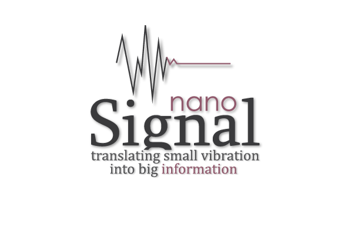
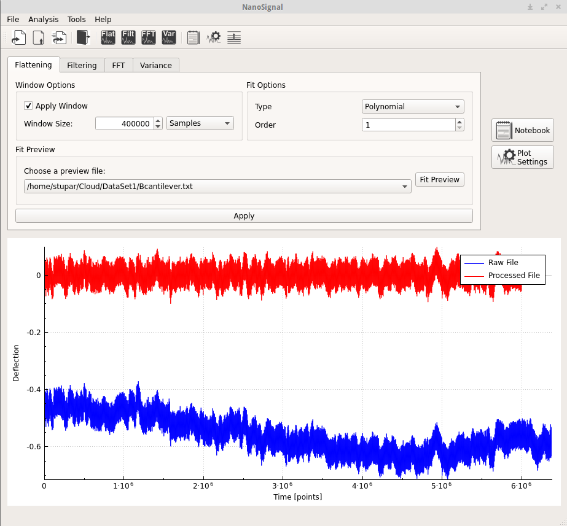
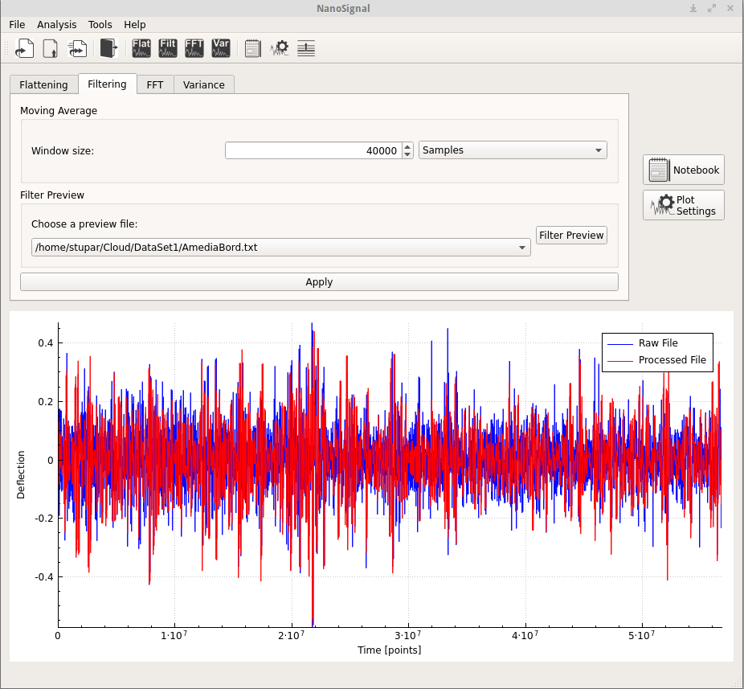
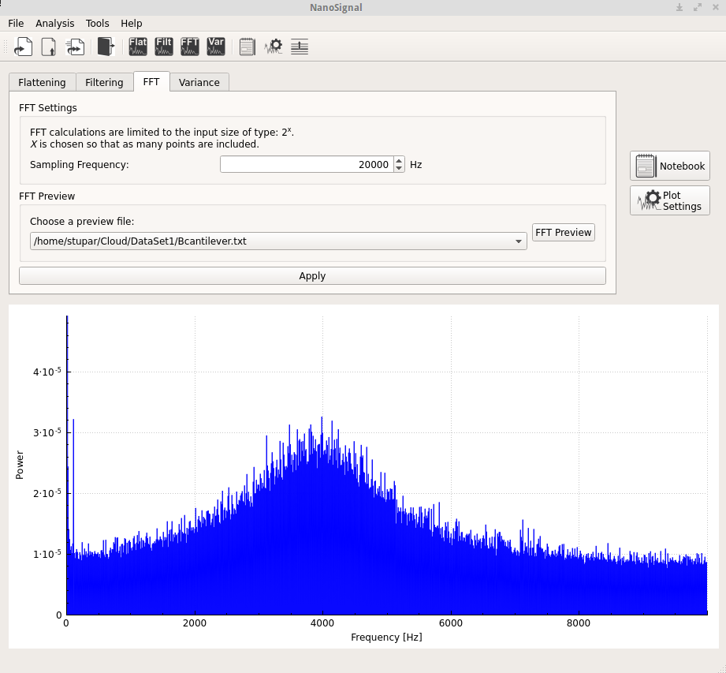
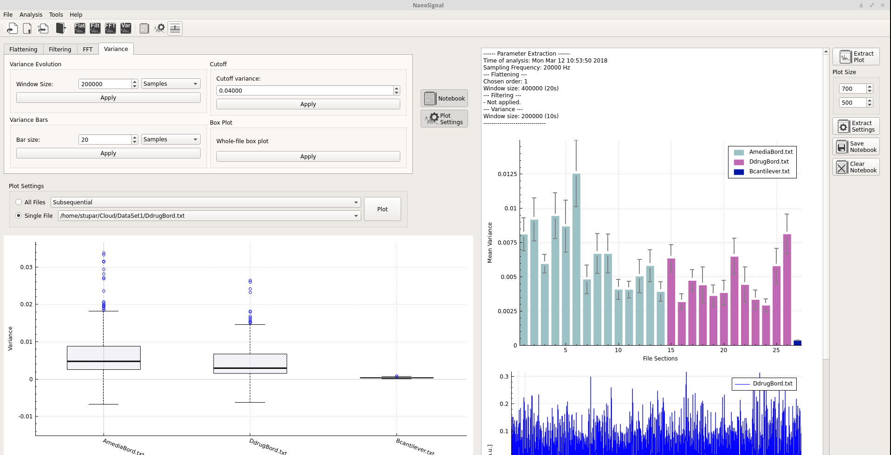
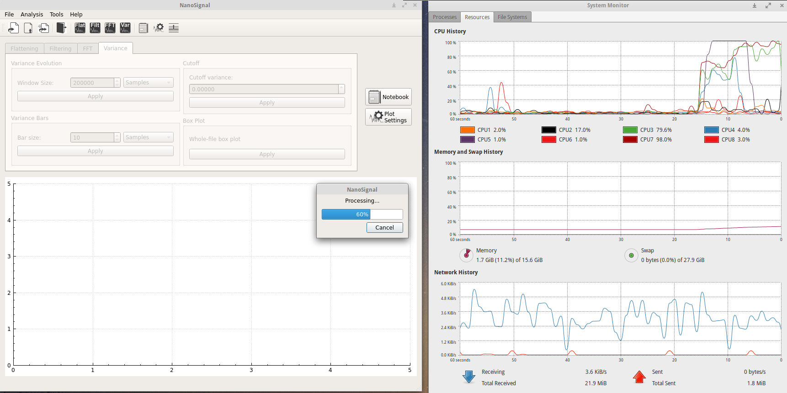
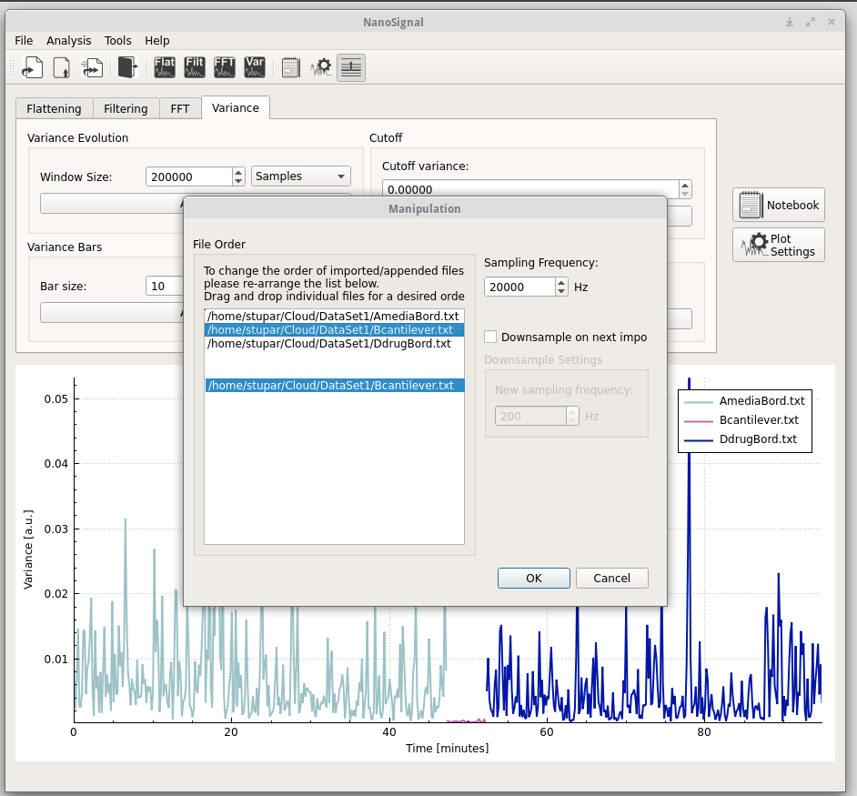

# NanoSignal
Signal processing toolbox.

## Features:

* Import & Append
* Fit & Detrend
* Filter
* FFT
* Variance
* Line plots, bar charts, box plots

* Multi-threading for faster analysis
* Notebook for keeping track of your analysis
* Export notes and graphs
* Manipulate file order and analysis parameters

## Screenshots

